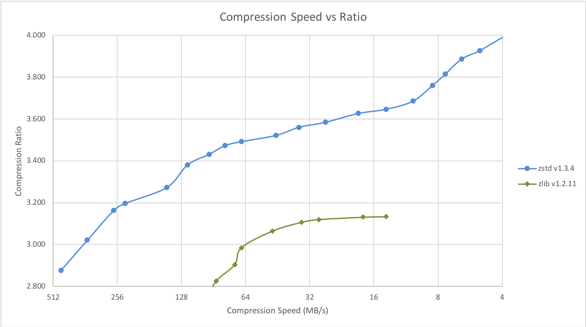
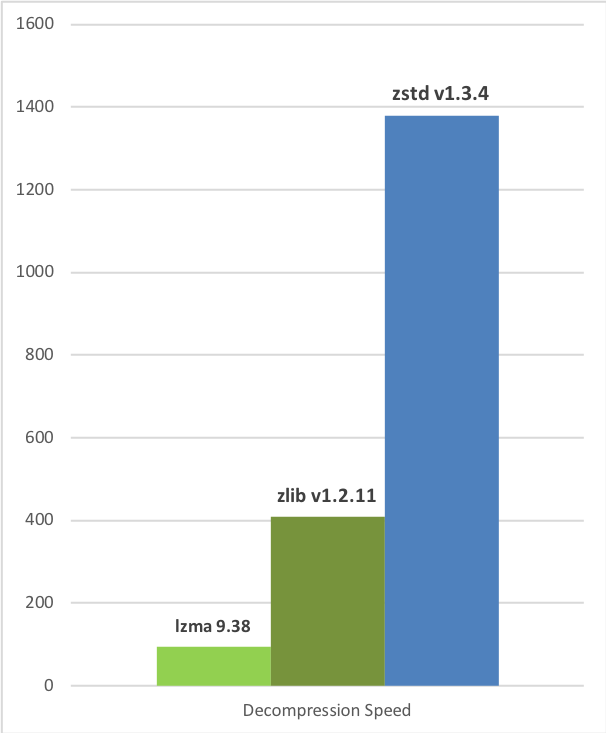
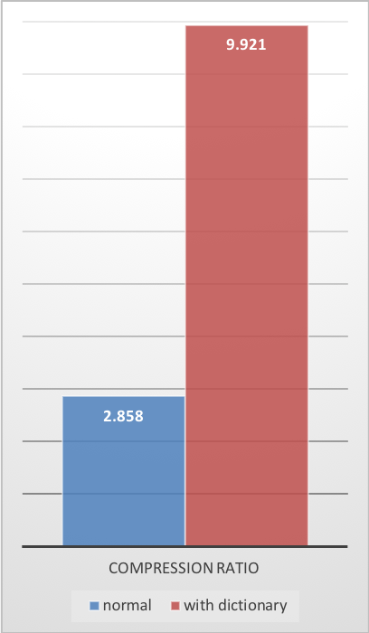
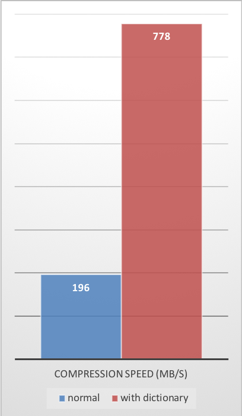
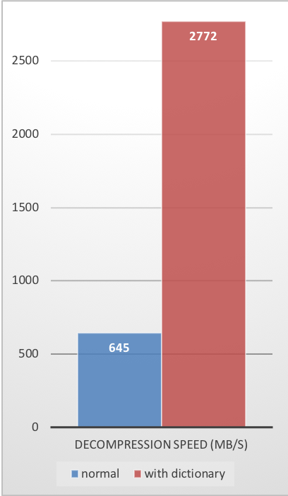

# Zstd Emscripten build

(c) 2016–2021 Ilmari Heikkinen, Fredrick R. Brennan. As with Zstd itself, this is dual-licensed under [BSD](LICENSE) and [GPLv2](COPYING).

**You can download `zstd.wasm` and `zstd.js` from the releases page: <https://github.com/ctrlcctrlv/zstd-emscripten/releases>**

This build is based on facebook/zstd as of 20 November 2021 and provides two functions: `ZStdCompress` and `ZStdDecompress`. Please see `emscripten/test/index.html` for a usage example.

Thanks to Ilmari Heikkinen, @kig, for their initial work on the CMake build. See commit [568bc158950234ceba8e917b6d69285984389249](https://github.com/ctrlcctrlv/zstd-emscripten/commit/568bc158950234ceba8e917b6d69285984389249) for my update.

## To build:

```bash
git clone https://github.com/emscripten-core/emsdk.git && cd emsdk && ./emsdk install latest && source ./emsdk_env.sh && cd .. &&
git clone https://github.com/kig/zstd-emscripten && cd zstd-emscripten &&
cd build && emcmake cmake ../contrib/cmake/ && emmake make -j4 && cd .. &&
serve -p 5000
# open http://localhost:5000/emscripten/test/index.html
```

## To use:

See the [test page](emscripten/test/index.html).

# ZStd README

__Zstandard__, or `zstd` as short version, is a fast lossless compression algorithm,
targeting real-time compression scenarios at zlib-level and better compression ratios.
It's backed by a very fast entropy stage, provided by [Huff0 and FSE library](https://github.com/Cyan4973/FiniteStateEntropy).

Zstandard's format is stable and documented in [RFC8878](https://datatracker.ietf.org/doc/html/rfc8878). Multiple independent implementations are already available.
This repository represents the reference implementation, provided as an open-source dual [BSD](LICENSE) and [GPLv2](COPYING) licensed **C** library,
and a command line utility producing and decoding `.zst`, `.gz`, `.xz` and `.lz4` files.
Should your project require another programming language,
a list of known ports and bindings is provided on [Zstandard homepage](http://www.zstd.net/#other-languages).

**Development branch status:**

[![Build Status][travisDevBadge]][travisLink]
[![Build status][AppveyorDevBadge]][AppveyorLink]
[![Build status][CircleDevBadge]][CircleLink]
[![Build status][CirrusDevBadge]][CirrusLink]
[![Fuzzing Status][OSSFuzzBadge]][OSSFuzzLink]

[travisDevBadge]: https://api.travis-ci.com/facebook/zstd.svg?branch=dev "Continuous Integration test suite"
[travisLink]: https://travis-ci.com/facebook/zstd
[AppveyorDevBadge]: https://ci.appveyor.com/api/projects/status/xt38wbdxjk5mrbem/branch/dev?svg=true "Windows test suite"
[AppveyorLink]: https://ci.appveyor.com/project/YannCollet/zstd-p0yf0
[CircleDevBadge]: https://circleci.com/gh/facebook/zstd/tree/dev.svg?style=shield "Short test suite"
[CircleLink]: https://circleci.com/gh/facebook/zstd
[CirrusDevBadge]: https://api.cirrus-ci.com/github/facebook/zstd.svg?branch=dev
[CirrusLink]: https://cirrus-ci.com/github/facebook/zstd
[OSSFuzzBadge]: https://oss-fuzz-build-logs.storage.googleapis.com/badges/zstd.svg
[OSSFuzzLink]: https://bugs.chromium.org/p/oss-fuzz/issues/list?sort=-opened&can=1&q=proj:zstd

## Benchmarks

For reference, several fast compression algorithms were tested and compared
on a server running Arch Linux (`Linux version 5.5.11-arch1-1`),
with a Core i9-9900K CPU @ 5.0GHz,
using [lzbench], an open-source in-memory benchmark by @inikep
compiled with [gcc] 9.3.0,
on the [Silesia compression corpus].

[lzbench]: https://github.com/inikep/lzbench
[Silesia compression corpus]: http://sun.aei.polsl.pl/~sdeor/index.php?page=silesia
[gcc]: https://gcc.gnu.org/

| Compressor name         | Ratio | Compression| Decompress.|
| ---------------         | ------| -----------| ---------- |
| **zstd 1.4.5 -1**       | 2.884 |   500 MB/s |  1660 MB/s |
| zlib 1.2.11 -1          | 2.743 |    90 MB/s |   400 MB/s |
| brotli 1.0.7 -0         | 2.703 |   400 MB/s |   450 MB/s |
| **zstd 1.4.5 --fast=1** | 2.434 |   570 MB/s |  2200 MB/s |
| **zstd 1.4.5 --fast=3** | 2.312 |   640 MB/s |  2300 MB/s |
| quicklz 1.5.0 -1        | 2.238 |   560 MB/s |   710 MB/s |
| **zstd 1.4.5 --fast=5** | 2.178 |   700 MB/s |  2420 MB/s |
| lzo1x 2.10 -1           | 2.106 |   690 MB/s |   820 MB/s |
| lz4 1.9.2               | 2.101 |   740 MB/s |  4530 MB/s |
| **zstd 1.4.5 --fast=7** | 2.096 |   750 MB/s |  2480 MB/s |
| lzf 3.6 -1              | 2.077 |   410 MB/s |   860 MB/s |
| snappy 1.1.8            | 2.073 |   560 MB/s |  1790 MB/s |

[zlib]: http://www.zlib.net/
[LZ4]: http://www.lz4.org/

The negative compression levels, specified with `--fast=#`,
offer faster compression and decompression speed in exchange for some loss in
compression ratio compared to level 1, as seen in the table above.

Zstd can also offer stronger compression ratios at the cost of compression speed.
Speed vs Compression trade-off is configurable by small increments.
Decompression speed is preserved and remains roughly the same at all settings,
a property shared by most LZ compression algorithms, such as [zlib] or lzma.

The following tests were run
on a server running Linux Debian (`Linux version 4.14.0-3-amd64`)
with a Core i7-6700K CPU @ 4.0GHz,
using [lzbench], an open-source in-memory benchmark by @inikep
compiled with [gcc] 7.3.0,
on the [Silesia compression corpus].

Compression Speed vs Ratio | Decompression Speed
---------------------------|--------------------
 | 

A few other algorithms can produce higher compression ratios at slower speeds, falling outside of the graph.
For a larger picture including slow modes, [click on this link](doc/images/DCspeed5.png).


## The case for Small Data compression

Previous charts provide results applicable to typical file and stream scenarios (several MB). Small data comes with different perspectives.

The smaller the amount of data to compress, the more difficult it is to compress. This problem is common to all compression algorithms, and reason is, compression algorithms learn from past data how to compress future data. But at the beginning of a new data set, there is no "past" to build upon.

To solve this situation, Zstd offers a __training mode__, which can be used to tune the algorithm for a selected type of data.
Training Zstandard is achieved by providing it with a few samples (one file per sample). The result of this training is stored in a file called "dictionary", which must be loaded before compression and decompression.
Using this dictionary, the compression ratio achievable on small data improves dramatically.

The following example uses the `github-users` [sample set](https://github.com/facebook/zstd/releases/tag/v1.1.3), created from [github public API](https://developer.github.com/v3/users/#get-all-users).
It consists of roughly 10K records weighing about 1KB each.

Compression Ratio | Compression Speed | Decompression Speed
------------------|-------------------|--------------------
 |  | 


These compression gains are achieved while simultaneously providing _faster_ compression and decompression speeds.

Training works if there is some correlation in a family of small data samples. The more data-specific a dictionary is, the more efficient it is (there is no _universal dictionary_).
Hence, deploying one dictionary per type of data will provide the greatest benefits.
Dictionary gains are mostly effective in the first few KB. Then, the compression algorithm will gradually use previously decoded content to better compress the rest of the file.

### Dictionary compression How To:

1. Create the dictionary

   `zstd --train FullPathToTrainingSet/* -o dictionaryName`

2. Compress with dictionary

   `zstd -D dictionaryName FILE`

3. Decompress with dictionary

   `zstd -D dictionaryName --decompress FILE.zst`


## Build instructions

### Makefile

If your system is compatible with standard `make` (or `gmake`),
invoking `make` in root directory will generate `zstd` cli in root directory.

Other available options include:
- `make install` : create and install zstd cli, library and man pages
- `make check` : create and run `zstd`, tests its behavior on local platform

### cmake

A `cmake` project generator is provided within `build/cmake`.
It can generate Makefiles or other build scripts
to create `zstd` binary, and `libzstd` dynamic and static libraries.

By default, `CMAKE_BUILD_TYPE` is set to `Release`.

### Meson

A Meson project is provided within [`build/meson`](build/meson). Follow
build instructions in that directory.

You can also take a look at [`.travis.yml`](.travis.yml) file for an
example about how Meson is used to build this project.

Note that default build type is **release**.

### VCPKG
You can build and install zstd [vcpkg](https://github.com/Microsoft/vcpkg/) dependency manager:

    git clone https://github.com/Microsoft/vcpkg.git
    cd vcpkg
    ./bootstrap-vcpkg.sh
    ./vcpkg integrate install
    ./vcpkg install zstd

The zstd port in vcpkg is kept up to date by Microsoft team members and community contributors.
If the version is out of date, please [create an issue or pull request](https://github.com/Microsoft/vcpkg) on the vcpkg repository.

### Visual Studio (Windows)

Going into `build` directory, you will find additional possibilities:
- Projects for Visual Studio 2005, 2008 and 2010.
  + VS2010 project is compatible with VS2012, VS2013, VS2015 and VS2017.
- Automated build scripts for Visual compiler by [@KrzysFR](https://github.com/KrzysFR), in `build/VS_scripts`,
  which will build `zstd` cli and `libzstd` library without any need to open Visual Studio solution.

### Buck

You can build the zstd binary via buck by executing: `buck build programs:zstd` from the root of the repo.
The output binary will be in `buck-out/gen/programs/`.

## Testing

You can run quick local smoke tests by executing the `playTest.sh` script from the `src/tests` directory.
Two env variables `$ZSTD_BIN` and `$DATAGEN_BIN` are needed for the test script to locate the zstd and datagen binary.
For information on CI testing, please refer to TESTING.md

## Status

Zstandard is currently deployed within Facebook. It is used continuously to compress large amounts of data in multiple formats and use cases.
Zstandard is considered safe for production environments.

## License

Zstandard is dual-licensed under [BSD](LICENSE) and [GPLv2](COPYING).

## Contributing

The `dev` branch is the one where all contributions are merged before reaching `release`.
If you plan to propose a patch, please commit into the `dev` branch, or its own feature branch.
Direct commit to `release` are not permitted.
For more information, please read [CONTRIBUTING](CONTRIBUTING.md).
